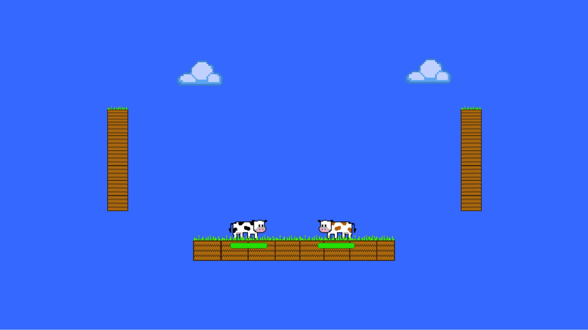

# Unity-PlatformFighter
A 2-Player Platform Fighting Game made with Unity and written in C#
## How to play
1. Download the repository
2. Run Crazy Cows/Builds/Windows/Crazy Cows.exe
3. Fight with a friend!

## Gameplay Features
Crazy Cows is a local 2-player platform fighting game. Cows can shoot layers, swing a sword, and jump on walls. Touching the boundaries results in immediate death, and losing all your health also results in death. 
## Controls
### Player1
A,D to move; W to jump; R to swing sword; T to shoot laser
### Player2
left/right arrow to move; up arrow to jump; / to swing sword; . to shoot laser
